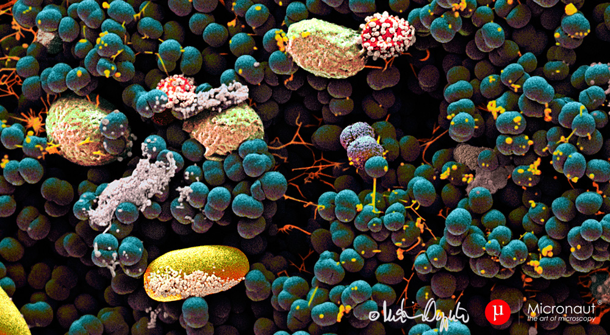

# Plotly-Challenge  
 **Submitted By:** Saloni Gupta\
_Date_: january, 23rd, 2020 
 
## Belly Button Biodiversity - Plot.ly

## Background
In this project, an interactive dashboard was built to explore the Belly Button Biodiversity Dataset, which catalogs the microbes that colonize human navels. The dataset reveals that a small handful of microbial species (also called operational taxonomic units, or OTUs, in the study) were present in more than 70% of people, while the rest were relatively rare.

The belly button is one of the habitats closest to us, and yet it remains relatively unexplored. In January 2011, we launched Belly Button Biodiversity to investigate the microbes inhabiting our navels, and the factors that might influence the microscopic life calling this protected, moist patch of skin home. In addition to inspiring scientific curiosity, Belly Button Biodiversity inspired conversations about the beneficial roles microbes play in our daily lives.

Source:The Public Science Lab

Use the interactive charts below to explore the dataset. Select a test subject ID number in a dropdown menu to see the relative sample results.

### Plotly - Bar Chart
In this task [samples.json](./templates/data/samples.json) file was read by using the D3 library, and a horizontal bar chart with a dropdown menu was created, and displayed on the top 10 OTUs found in that individual. The appropriate values <code> (sample_values) </code>, <code> lables(otu_ids) </code>,and hover text <code>(otu_labels )</code> assigned to the bar chart.

### Plotly - Bubble Chart
A bubble chart was created on the following values

<code> otu_ids </code> for the x values.  
<code> sample_values </code> for the y values.  
<code> sample_values </code> for the marker size.  
<code> otu_ids </code> for the marker colors.  
<code> otu_labels </code> for the text values.  

### Demographic Information
A box is created to display an individual's demographic information from the sample metadata.

### Gauge Chart
A Gauge Chart was created to plot the weekly washing frequency of the individual.

Over All layout
The dashboard looks as follows:

### Deployment
This app is deployed public on GitHub page, click the following link to see how it looks like [Belly Button Biodiversity Dashboard](https://salonigupta1201.github.io/Plotly-Challenge/templates/index.html)

### About the Data
Hulcr, J. et al.(2012) A Jungle in There: Bacteria in Belly Buttons are Highly Diverse, but Predictable. Retrieved from: http://robdunnlab.com/projects/belly-button-biodiversity/results-and-data/
 
